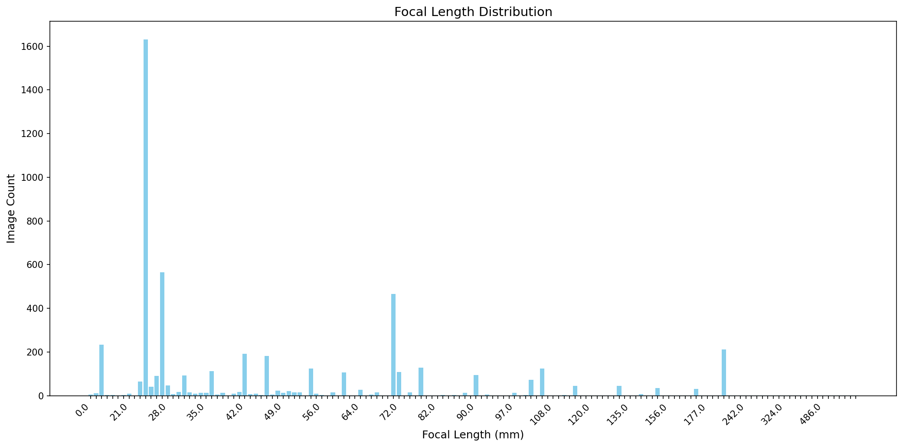

# EXIF Focal Length Analyzer

批量提取JPEG照片的焦距(EXIF)信息并生成统计报告



## 功能
- 扫描目录中的JPEG文件
- 提取焦距信息（单位：毫米）
- 生成CSV统计表格
- 创建焦距分布条形图

## 使用
```bash
python focal_analyzer.py /照片目录1 /照片目录2 /输出目录
```

## 输出示例
```
正在分析目录: ['D:\\Files\\Camera\\']...

===== 分析结果 =====
扫描图片总数: 5372
包含焦距信息的图片: 5362
缺少EXIF数据的图片: 10

焦距统计已保存至: D:\Desktop\focal_length_stats.csv
分布图表已保存至: D:\Desktop\focal_length_chart.png

最常见的焦距: 24.0mm (共 1632 张)
```

## 输出文件

1. `focal_length_stats.csv` - 焦距统计表格
2. `focal_length_chart.png` - 焦距分布图